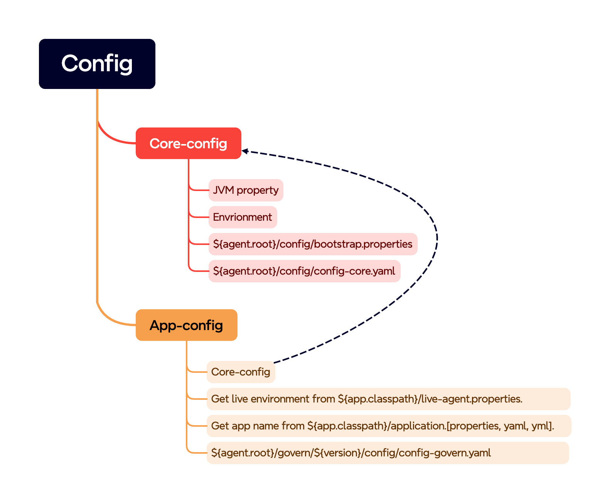

# 版本1遗留的的问题

1. 不能动态注入方式进行治理
2. 不支持J2EE多个应用
3. 不支持热更新治理扩展和插件
4. 不支持熔断策略

## 1. 动态增强设计

满足动态注入方式进行治理，支持多个应用，支持热更新。

## 1.1 类加载器设计


类加载器关系

```mermaid
classDiagram
direction BT
class LiveAgentClassLoader
class LiveAppClassLoader
class LivePluginClassLoader

LiveAgentClassLoader ..> SystemClassLoader
LiveAppClassLoader  ..>  LiveAgentClassLoader
LiveAppClassLoader  ..>  ApplicationClassLoader
LivePluginClassLoader  ..>  LiveAppClassLoader

```

为每个版本生成对于的多活应用加载器，方便热更新

## 1.2 目录结构

### 1.2.1 打包程序目录

把治理相关的API、扩展、插件和配置放到govern目录，便于按照应用来加载和动态更新


### 1.2.2 工程目录

```
.
└── joylive-agent
    ├── joylive-bom
    ├── joylive-bootstrap
    ├── joylive-core
    │   ├── joylive-core-api
    │   ├── joylive-core-bootstrap
    │   ├── joylive-core-extension-jplug
    │   ├── joylive-core-parser-jackson
    │   ├── ......
    ├── joylive-govern
    │   ├── joylive-governace-api
    │   ├── joylive-governace-metric-opentelemetry
    │   ├── joylive-governace-function-bkdrhash
    │   ├── joylive-governace-service-file
    │   ├── ......
    ├── joylive-plugin
    ├── joylive-demo
    ├── joylive-test
    ├── joylive-package

```
拆分了joylive-core和joylive-implement

## 1.2 配置



## 1.3 应用状态


在流量治理扩展里面，根据应用启动状态和治理状态来控制流量。

1. 应用启动状态为READY才能入流量

2. 应用治理状态为GOVERN_READY才进行流量治理

静态注入时候，在应用状态为STARTED的时候等待策略同步完成，当应用状态为READY的时候，治理状态已经为GOVERN_READY
动态注入时候，应用状态初始化为READY，治理初始状态为INITIAL，这个时候允许流量继续进入，当策略就绪并且重新更新注册后，治理才生效。

## 1.4 应用启动

静态注入Fatjar的时候，需要获取到应用类加载器

动态注入的时候，需要获取到应用上下文，并从中获取到应用提供的服务，便于同步服务的治理策略。同时需要刷新注册中心，注入多活的标签。

通过插件及应用提供者扩展，来感知应用的启动事件。多种方式可能触发了相同的应用启动事件，需要过滤掉重复的事件。

```mermaid
classDiagram
direction BT
class AppContext {
  + getContext() T ~T~
  + getClassLoader() Classloader
}
class AppProvider {
  
}

<<Interface>> AppProvider
AppProvider --> AppContext 
```

### 1.4.1 `Springboot`类加载器

Springboot支持Jar和War两种启动方式

静态注入可以拦截`org.springframework.boot.loader.LaunchedURLClassLoader`的构造函数，获取到应用类加载器并发出应用启动事件。

### 1.4.1 `Springboot`事件拦截

静态注入可以拦截`org.springframework.boot.SpringApplicationRunListeners`的相关方法，触发应用事件

```mermaid
classDiagram
direction BT
class SpringApplicationRunListeners {
  ~ environmentPrepared(ConfigurableBootstrapContext, ConfigurableEnvironment) void
  ~ contextPrepared(ConfigurableApplicationContext) void
  ~ ready(ConfigurableApplicationContext, Duration) void
  ~ contextLoaded(ConfigurableApplicationContext) void
  ~ starting(ConfigurableBootstrapContext, Class~?~) void
  ~ started(ConfigurableApplicationContext, Duration) void
}

```

### 1.4.2 `JMX`获取`ConfigurableApplicationContext`

动态注入，需要拿到启动的应用上下文。

通过调用本地JMX方法获取MXBean。

1. 从JMX中查询MBean，并调用转换器进行转换
```java
@SuppressWarnings("unchecked")
public static <T> List<T> getMBeans(String queryName, Function<Object, T> converter) {
    List<T> result = new ArrayList<>();
    if (queryName != null && !queryName.isEmpty()) {
        try {
            MBeanServer server = ManagementFactory.getPlatformMBeanServer();
            Class<?> dynamicMBean2Class = Class.forName("com.sun.jmx.mbeanserver.DynamicMBean2");
            Method getResourceMethod = dynamicMBean2Class.getDeclaredMethod("getResource");
            Class<?> nameamedObjectClass = Class.forName("com.sun.jmx.mbeanserver.NamedObject");
            Method getObjectMethod = nameamedObjectClass.getDeclaredMethod("getObject");

            Field msbInterceptorField = server.getClass().getDeclaredField("mbsInterceptor");
            msbInterceptorField.setAccessible(true);
            Object mbsInterceptor = msbInterceptorField.get(server);

            Field repositoryField = mbsInterceptor.getClass().getDeclaredField("repository");
            repositoryField.setAccessible(true);
            Object repository = repositoryField.get(mbsInterceptor);

            Field domainTbField = repository.getClass().getDeclaredField("domainTb");
            domainTbField.setAccessible(true);
            Map<String, Map<String, ?>> domainTb = (Map<String, Map<String, ?>>) domainTbField.get(repository);

            Set<ObjectInstance> instances = server.queryMBeans(new ObjectName(queryName), null);
            for (ObjectInstance instance : instances) {
                ObjectName objectName = instance.getObjectName();
                Object namedObject = domainTb.get(objectName.getDomain()).get(objectName.getCanonicalKeyPropertyListString());
                Object dynamicMBean = getObjectMethod.invoke(namedObject);
                Object mbean = getResourceMethod.invoke(dynamicMBean);
                T target = converter != null ? converter.apply(mbean) : (T) mbean;
                if (target != null) {
                    result.add(target);
                }
            }
            return result;
        } catch (Throwable ignore) {
        }
    }
    return result;
}
```
2. 查询Springboot的MBean，并通过反射获取其上下文
```java
public static List<ConfigurableApplicationContext> getApplicationContexts() {
    try {
        Field contextField = SpringApplicationAdminMXBeanRegistrar.class.getDeclaredField("applicationContext");
        contextField.setAccessible(true);
        return getMBeans("org.springframework.boot:type=Admin,name=*", target -> {
            try {
                Field outerField = target.getClass().getDeclaredField("this$0");
                outerField.setAccessible(true);
                Object registrar = outerField.get(target);
                return (ConfigurableApplicationContext) contextField.get(registrar);
            } catch (Throwable e) {
                return null;
            }
        });
    } catch (Throwable e) {
        return new ArrayList<>();
    }
}
```
MBean的查询名称可以作为参数传递

### 1.5 服务策略订阅

在注册中心插件里面，拦截器的构造函数里面，通过当前应用的上下文对象拿到已经创建好的注册对象进行订阅

### 1.6 服务注册元数据更新

#### 1.6.1 Nacos

nacos支持在心跳事件里面更新元数据，可以拦截心跳事件，根据应用状态对元数据进行重新赋值。

#### 1.6.2 其它

在注册中心插件里面，拦截器的构造函数里面，注册应用事件，当服务策略就绪的时候，异步注销和重新注册服务。

