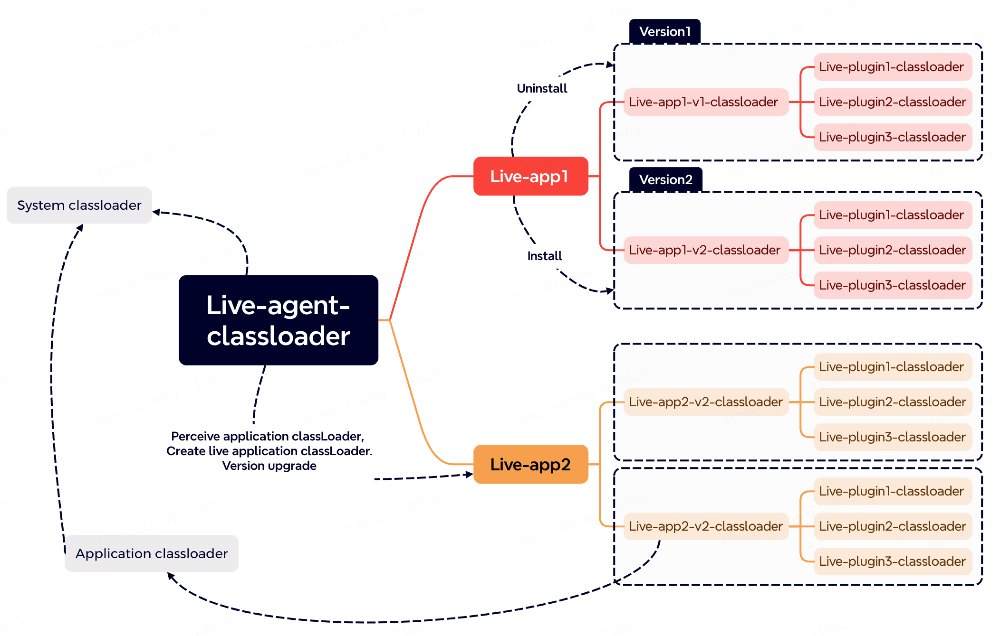
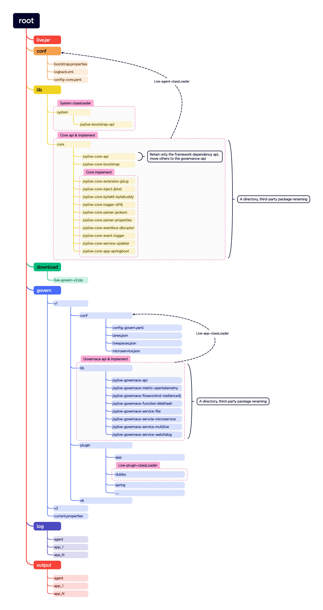

# 版本1遗留的的问题

1. 不能动态注入方式进行治理
2. 不支持J2EE多个应用
3. 不支持热更新治理扩展和插件
4. 不支持熔断策略

## 1. 动态增强设计

满足动态注入方式进行治理，支持多个应用，支持热更新。

## 1.1 类加载器设计



类加载器关系

```mermaid
classDiagram
direction BT
class LiveAgentClassLoader
class LiveAppClassLoader
class LivePluginClassLoader

LiveAgentClassLoader ..> SystemClassLoader
LiveAppClassLoader  ..>  LiveAgentClassLoader
LiveAppClassLoader  ..>  ApplicationClassLoader
LivePluginClassLoader  ..>  LiveAppClassLoader

```

为每个版本生成对于的多活应用加载器，方便热更新

## 1.2 目录结构

### 1.2.1 打包程序目录

把治理相关的API、扩展、插件和配置放到govern目录，便于按照应用来加载和动态更新



### 1.2.2 工程目录

```
.
└── joylive-agent
    ├── joylive-bom
    ├── joylive-bootstrap
    ├── joylive-core
    │   ├── joylive-core-api
    │   ├── joylive-core-bootstrap
    │   ├── joylive-core-extension-jplug
    │   ├── joylive-core-parser-jackson
    │   ├── ......
    ├── joylive-govern
    │   ├── joylive-governace-api
    │   ├── joylive-governace-metric-opentelemetry
    │   ├── joylive-governace-function-bkdrhash
    │   ├── joylive-governace-service-file
    │   ├── ......
    ├── joylive-plugin
    ├── joylive-demo
    ├── joylive-test
    ├── joylive-package

```
拆分了joylive-core和joylive-implement

## 1.2 配置


## 1.3 应用状态


在流量治理扩展里面，根据应用启动状态和治理状态来控制流量。

1. 应用启动状态为READY才能入流量

2. 应用治理状态为POLICY_READY才进行流量治理

静态注入时候，在应用状态为STARTED的时候等待策略同步完成，当应用状态为READY的时候，治理状态已经为POLICY_READY
动态注入时候，应用状态初始化为READY，治理初始状态为INITIAL，这个时候允许流量继续进入，当策略就绪的时候才治理扩展才生效。
